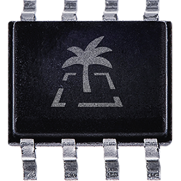
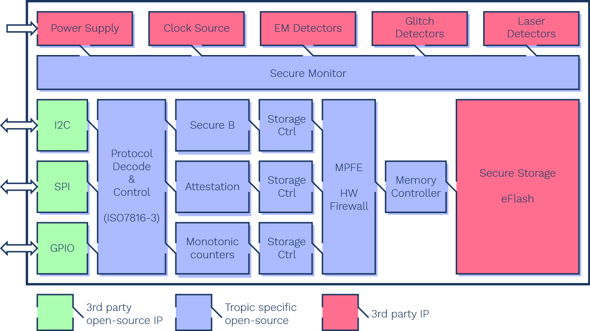

# TASSIC

**The Transparent Authenticated Secure Storage Integrated Circuit (TASSIC)** from Tropic Square is a cryptographically and physically secured, non-volatile storage chip.

TASSIC is designed for the special purpose of handling digital secrets and serving as a fundamental building block for digital trust, in a minimalistic implementation. Its cryptographic key management and ability to derive a digital unique identity secures storage in embedded systems and trusted digital devices.

Serial interfaces and compatibility with the ISO 7816-3 protocol positions TASSIC as a drop-in replacement for serial flash devices and secure elements. It shortens time to market with transparent and auditable chip implementation.  Open-source, production-grade software drivers and an FPGA-executable functional model of TASSIC are coming soon.

## Key Features

* **TASSIC** transformation of a low-entropy secret (PIN) to a high-entropy secret can be used in **various cryptographic applications**.
* **TASSIC focuses on security** at all stages of the chip lifecycle. From manufacturing, through deployment, runtime, **and even when powered off**.
* **I2C, SPI attached to Host MCU**
* **HW Ed25519 cryptography**
* **Chacha20-Poly1305 AEAD**
* **SHA2, BLAKE2 hash algorithms**
* **Side-channel resistance**
* **Voltage and clock glitch detection**
* **EM pulse and laser fault injection detectors**
* **8-pin package & microSD card**

## Block diagram

## Flyer

* [download PDF](assets/TASSIC_TropicSquare.pdf)
